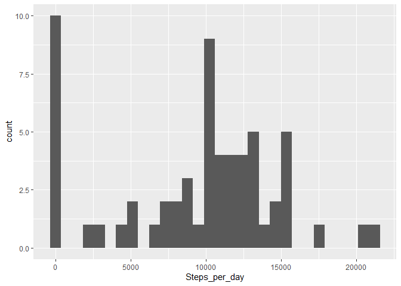
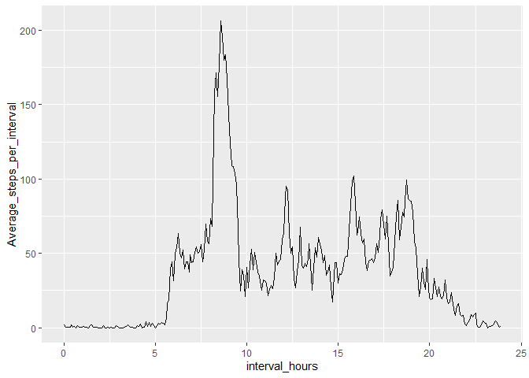
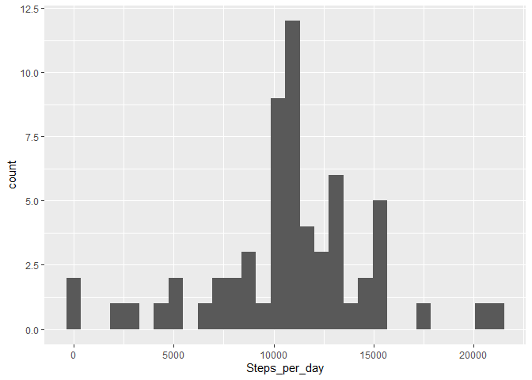
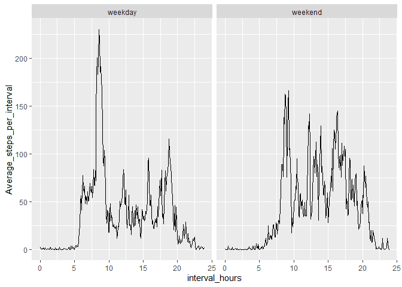

```r
library(dplyr)
library(ggplot2)
```


## Loading and Preprocessing the data

Firstly we'll load the dataset in the file "activity.csv" to a data frame and view the summary of the data. We'll also check for NA values in the different columns of the dataframe


```r
activity <- read.csv("activity.csv")
str(activity)
```

```
## 'data.frame':	17568 obs. of  3 variables:
##  $ steps   : int  NA NA NA NA NA NA NA NA NA NA ...
##  $ date    : chr  "2012-10-01" "2012-10-01" "2012-10-01" "2012-10-01" ...
##  $ interval: int  0 5 10 15 20 25 30 35 40 45 ...
```

```r
paste("The number of NA values in the steps variable are",sum(is.na(activity$steps)))
```

```
## [1] "The number of NA values in the steps variable are 2304"
```

```r
paste("The number of NA values in the data variable are",sum(is.na(activity$date)))
```

```
## [1] "The number of NA values in the data variable are 0"
```

```r
paste("The number of NA values in the interval variable are",sum(is.na(activity$interval)))
```

```
## [1] "The number of NA values in the interval variable are 0"
```

We need to change the class of date from character to Date.


```r
activity$date <- as.Date(activity$date)
```

For interval we face a challenge. Since interval is given in numeric format. A change in interval from 1055 to 1100 leads to a gap in the time series plot. Similarly for every change in R if plotted directly we get a lot of gaps in the time series plots.

To deal with this issue, we create a new variable called *interval_hours* which expresses the interval in terms of hours, using the formula, Hours + Minutes/60. So 1130 becomes 11.5 and 115 becomes 1.25.

Also the interval variable is also changed to a string format of "%H:%M", for easier representation


```r
activity$interval_hours <- format(round((activity$interval)/100,2),nsmall = 2)

activity$interval_hours <- as.numeric(format(strptime(activity$interval_hours, format = "%H.%M"), "%H")) + as.numeric(format(strptime(activity$interval_hours, format = "%H.%M"), "%M"))/60

activity$interval <- format(strptime(format(round(activity$interval/100,2),nsmall = 2), format = "%H.%M"), "%H:%M")
```

Finally our dataframe looks as follows:


```r
str(activity)
```

```
## 'data.frame':	17568 obs. of  4 variables:
##  $ steps         : int  NA NA NA NA NA NA NA NA NA NA ...
##  $ date          : Date, format: "2012-10-01" "2012-10-01" ...
##  $ interval      : chr  "00:00" "00:05" "00:10" "00:15" ...
##  $ interval_hours: num  0 0.0833 0.1667 0.25 0.3333 ...
```

Thus having pre-processed the data we'll move on to the various analysis

## Mean of total number of steps per day

For the first step we had to calculate the total number of steps taken per day.

To do this we'll make a new dataframe called date_steps which will store the number of steps in each day. The code chunk to create the dataframe and a view of the data frame is below:


```r
date_steps <- activity %>%
    group_by(date) %>%
    summarise(Steps_per_day = sum(steps,na.rm = TRUE))

head(date_steps)
```

```
## # A tibble: 6 x 2
##   date       Steps_per_day
##   <date>             <int>
## 1 2012-10-01             0
## 2 2012-10-02           126
## 3 2012-10-03         11352
## 4 2012-10-04         12116
## 5 2012-10-05         13294
## 6 2012-10-06         15420
```

Now we'll plot a histogram of number of steps taken per day. The code and results are:


```r
ggplot(data = date_steps, aes(x = Steps_per_day)) + geom_histogram()
```

<!-- -->

Finally we have to find the mean and median of the number of steps taken per day. They are:


```r
cat("The mean of the number of steps taken per day is",mean(date_steps$Steps_per_day))
```

```
## The mean of the number of steps taken per day is 9354.23
```


```r
cat("The median of the number of steps taken per day is",median(date_steps$Steps_per_day))
```

```
## The median of the number of steps taken per day is 10395
```

## Average Daily Activity Pattern

We have to plot the time series of the average number of steps averaged across all days for each 5 minute interval. Again, we'll make a new dataframe called step_interval which stores the average number of steps averaged across all days for each 5 minute interval.


```r
step_interval <- activity %>%
    group_by(interval, interval_hours) %>%
    summarise(Average_steps_per_interval = mean(steps,na.rm = TRUE))

head(step_interval)
```

```
## # A tibble: 6 x 3
## # Groups:   interval [6]
##   interval interval_hours Average_steps_per_interval
##   <chr>             <dbl>                      <dbl>
## 1 00:00            0                          1.72  
## 2 00:05            0.0833                     0.340 
## 3 00:10            0.167                      0.132 
## 4 00:15            0.25                       0.151 
## 5 00:20            0.333                      0.0755
## 6 00:25            0.417                      2.09
```

Here grouping by both interval and interval_hours does not create any problem because both represent the same quantity, the time of the day, in two different ways. For each interval there is a **unique** interval_hours and vice versa.

Having made this new dataframe, we'll use it to make the time series. To plot the time series we'll use the interval_hours variable, so that there is no gap. The time series can be plotted as shown below:


```r
ggplot(data = step_interval, aes(x = interval_hours, y = Average_steps_per_interval)) + geom_line()
```

<!-- -->

We also need to find the 5 minute interval with the maximum average number of steps. It is as follows:


```r
step_interval$interval[which.max(step_interval$Average_steps_per_interval)]
```

```
## [1] "08:35"
```

## Imputing Missing Values

The total  number of missing values in the data are:

```r
sum(is.na(activity))
```

```
## [1] 2304
```

On observing the dataframe activity we find that only the steps variable has NA values, and also that there are whole days with missing values, i.e. the steps has NA for each interval of the whole day. Given the variation within the average seen in the previous day we'll impute the missing values with the average stps value for the interval of the data.

It is done as follows:

```r
for (i in 1:length(activity$steps)){
    if (is.na(activity$steps[i])){
        activity$steps[i] <- step_interval$Average_steps_per_interval[step_interval$interval == activity$interval[i]]
    }
}
```

The updated histogram, mean and median are as follows:


```r
date_steps <- activity %>%
    group_by(date) %>%
    summarise(Steps_per_day = sum(steps))


ggplot(data = date_steps, aes(x = Steps_per_day)) + geom_histogram()
```

<!-- -->

```r
mean(date_steps$Steps_per_day)
```

```
## [1] 10766.19
```

```r
median(date_steps$Steps_per_day)
```

```
## [1] 10766.19
```

## Activity Patterns

We create a new variable called day_type with two different factors "weekday" and "weekend". After that we make a panel plot using ggplot for the  two different types of days


```r
wd <- c("Monday","Tuesday","Wednesday","Thursday","Friday")
we <- c("Saturday","Sunday"
        )
activity <- activity %>%
    mutate(day_type = ifelse(test = weekdays(date) %in% wd, yes = "weekday", no = "weekend"))

activity$day_type <- as.factor(activity$day_type)

step_interval <- activity %>%
    group_by(interval, interval_hours, day_type) %>%
    summarise(Average_steps_per_interval = mean(steps))


ggplot(data = step_interval, aes(x = interval_hours, y = Average_steps_per_interval)) + geom_line() + facet_grid(.~day_type)
```

<!-- -->
